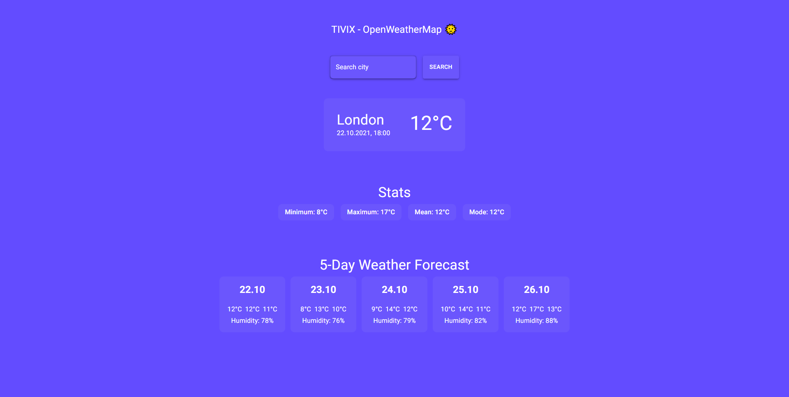
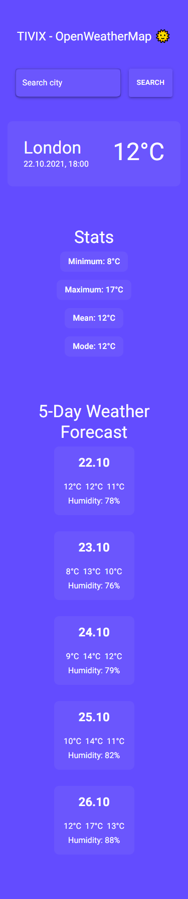

# OpenWeatherMap App

Weather APP that shows the 5-day weather forecast for a given city and stats relevant to the weather forecast.
To get started, simply go to:

```
https://tivix-openweathermap.vercel.app/
```

or in your terminal:

```
git clone https://github.com/adrianfrackowiak/tivix-openweathermap.git
cd tivix-openweathermap
yarn install
yarn dev
```

and go to http://localhost:3000

### How it works

You can search city and check the weather. App will show you 5-day weather forecast including:

- Morning temperature
- Day temperature
- Night temperature
- Humidity

Notice, that if current time is for example 18:00, 5-day forecast will show you current weather for morning and day temperature - (because of free api https://openweathermap.org/forecast5).

You can also find some stats for all temperatures like:

- Minimum value
- Maximum value
- Mean value
- Mode value

### Tech stack

- ReactJS
- TypeScript
- Next.js
- SWR
- Material-UI v5

## v2.0.0 - OpenWeatherMap App


## v1.0.0 - Tivix - OpenWeatherMap (Recruitment task)



